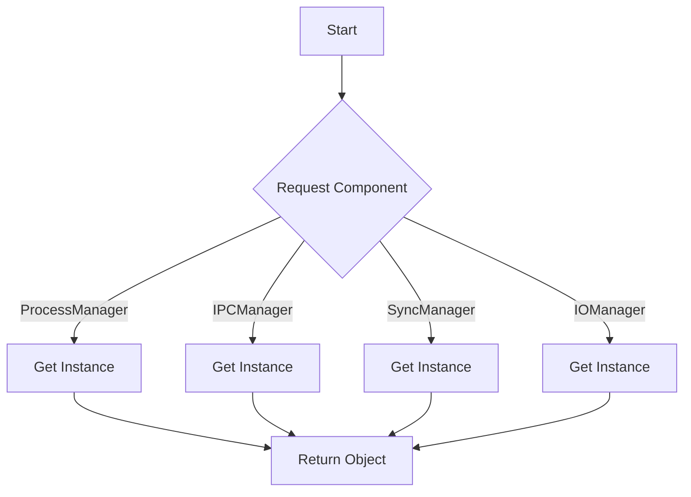

# Kernel.java Documentation

## Flowchart

## Line-by-Line Explanation

| Line | Code Snippet | Explanation |
| :--- | :--- | :--- |
| `5` | `public class Kernel` | The main entry point or global access point for the kernel components. |
| `7` | `private static final ProcessManager processManager = new ProcessManager();` | Static instance of the Process Manager. |
| `10` | `private static final kernx.os.ipc.IPCManager ipcManager = kernx.os.ipc.IPCManager.getInstance();` | Singleton instance for IPC Management. |
| `11` | `private static final kernx.os.sync.SyncManager syncManager = kernx.os.sync.SyncManager.getInstance();` | Singleton instance for Synchronization Management. |
| `13` | `public static ProcessManager getProcessManager()` | Global getter for process management. |
| `17` | `public static kernx.os.ipc.IPCManager getIPCManager()` | Global getter for IPC services. |
| `22` | `public static kernx.os.sync.SyncManager getSyncManager()` | Global getter for thread synchronization. |
| `26` | `public static kernx.os.io.IOManager getIOManager()` | Global getter for I/O operations. |

## Code Flow & Dry Run Example

**Scenario**: A UI component needs to list all processes.

1.  UI calls `Kernel.getProcessManager()`.
2.  `Kernel` returns the static `processManager` instance.
3.  UI then calls `processManager.getAllProcesses()` on that returned instance.
4.  This pattern ensures all project parts use the same single instances of core managers.
