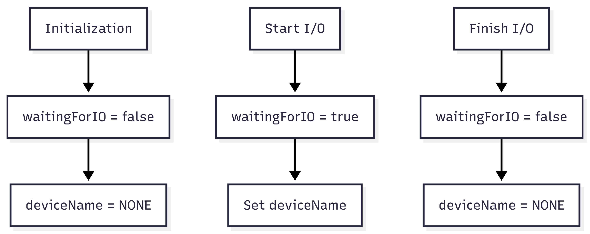

# IOState.java Documentation

## Flowchart

## Line-by-Line Explanation

| Line | Code Snippet | Explanation |
| :--- | :--- | :--- |
| `5` | `public class IOState` | Holds the I/O status for a single process. |
| `6` | `private boolean waitingForIO` | Flag indicating if the process is currently blocked waiting for a device. |
| `7` | `private String deviceName` | The name of the device the process is waiting for. |
| `14` | `public void setWaitingForIO(...)` | Updates the blocked status. |

## Code Flow & Dry Run Example

**Scenario**: Process PID 101 requests Printer.
1. `waitingForIO` is initially `false`.
2. Process requests "Printer". 
3. `IOState` for PID 101 is updated: `waitingForIO = true`, `deviceName = "Printer"`.
4. When Printer is released, `waitingForIO` becomes `false` and `deviceName` returns to `NONE`.
