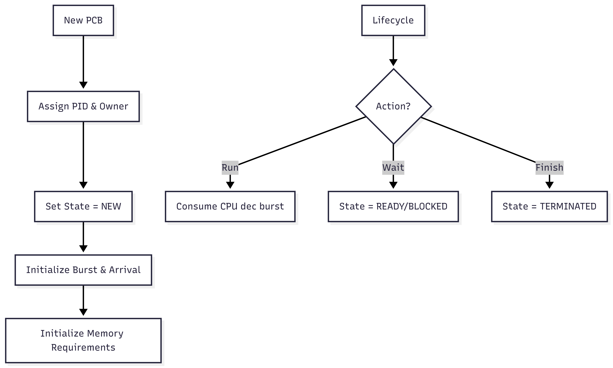

# PCB.java (Process Control Block) Documentation

## Flowchart

## Line-by-Line Explanation

| Line | Code Snippet | Explanation |
| :--- | :--- | :--- |
| `8` | `public class PCB` | Central data structure for a process. |
| `11` | `private final int pid;` | Unique Process ID. |
| `36` | `private int remainingBurstTime;` | Ticks left before completion. |
| `37` | `private int quantumCounter;` | Ticks used in current Round Robin turn. |
| `47` | `this.pid = IDGenerator.generatePID();` | Auto-assigns next available ID. |
| `98` | `consumeCpu()` | Called by `ProcessManager.tick()`. Reduces remaining work. |
| `120` | `getPageTable()` | Links to Memory Management. |

## Code Flow & Dry Run Example

**Scenario**: New Process "Chrome" (100MB).

1.  **Creation**: `new PCB("Chrome", 100, 1)`.
2.  **Fields**: `pid`=101, `state`=NEW, `remainingBurst`=20 (calculated default).
3.  **Execution**: `consumeCpu()` called 5 times.
    *   `remainingBurst` becomes 15.
    *   `quantumCounter` becomes 5.
