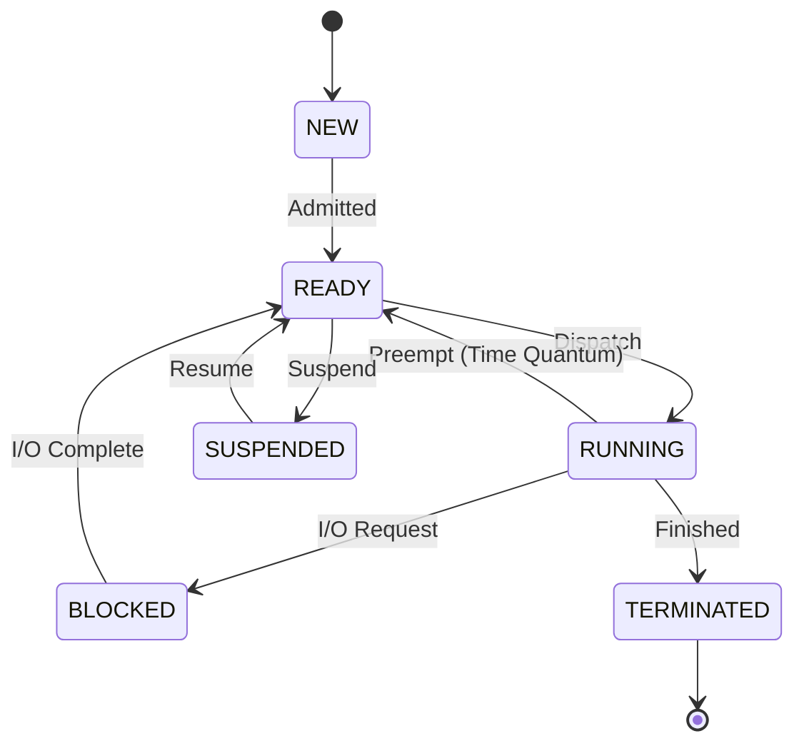

# ProcessState.java Documentation

## Diagram

## Explanation

| Enum Value | Meaning |
| :--- | :--- |
| `NEW` | Process is being created, memory not yet fully stable. |
| `READY` | In memory, waiting for CPU. |
| `RUNNING` | Currently executing instructions on the CPU. |
| `BLOCKED` | Waiting for external event (I/O, Semaphore). |
| `SUSPENDED` | Swapped out to disk (Medium Term Scheduling). |
| `TERMINATED` | Execution finished, waiting to be cleared. |
