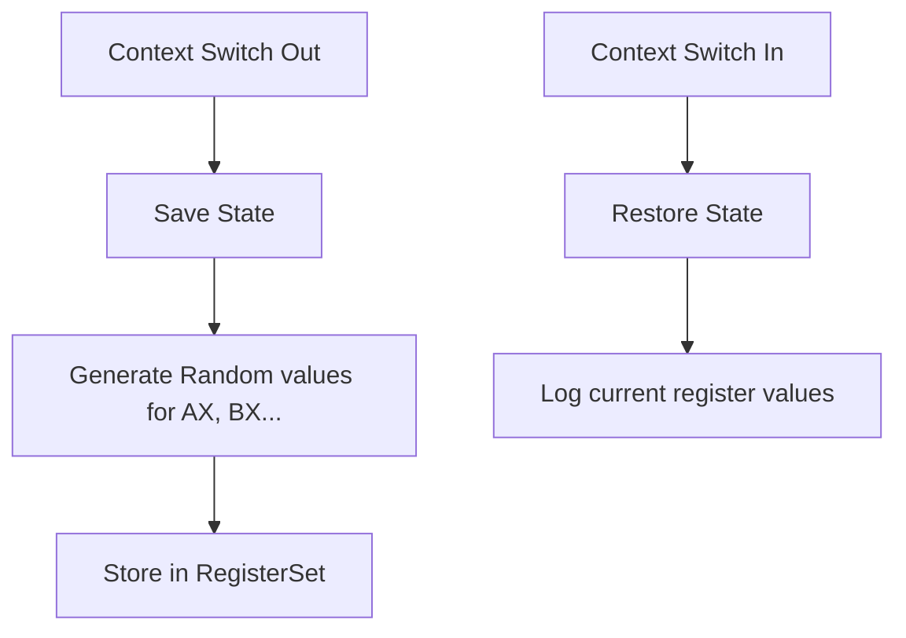

# RegisterSet.java Documentation

## Flowchart

## Line-by-Line Explanation

| Line | Code Snippet | Explanation |
| :--- | :--- | :--- |
| `4` | `public class RegisterSet` | Simulates CPU registers for context switching. |
| `6` | `private int AX, BX, CX, DX, PC, SP` | Architectural registers. |
| `15` | `public void save()` | Snapshot of current dummy execution state. |
| `20` | `public void restore()` | Restores the saved state to the "CPU". |

## Code Flow & Dry Run Example

**Scenario**: Process P1 is preempted by P2.
1. P1's `save()` is called. `RegisterSet` stores `AX=55, BX=12...`.
2. CPU runs P2.
3. Later, P1 is scheduled again.
4. P1's `restore()` is called. The log shows `Restoring AX=55, BX=12...` ensuring P1 resumes correctly.
