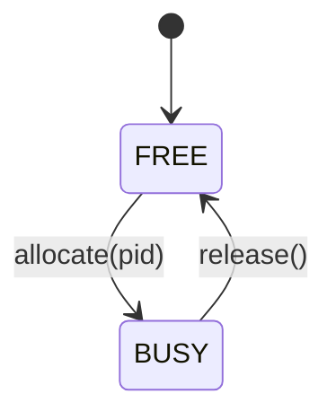

# IODevice.java Documentation

## Flowchart

## Line-by-Line Explanation

| Line | Code Snippet | Explanation |
| :--- | :--- | :--- |
| `3` | `public class IODevice` | Represents a physical or logical I/O device (e.g., Printer). |
| `4-7` | `private final String name; ... int currentOwnerPid;` | Attributes: Name, Type, State (isBusy), and the PID using it. |
| `9` | `public IODevice(String name, String type)` | Constructor initializing the device in a FREE state. |
| `22` | `public void allocate(int pid)` | Marks the device as busy and records the owner. |
| `27` | `public void release()` | Resets the device to an idle/free state. |

## Code Flow & Dry Run Example

**Scenario**: A process with PID 10 wants to use the Printer.

1.  The `IOManager` finds the `IODevice` named "Printer".
2.  `printer.allocate(10)` is called.
3.  `isBusy` becomes `true`.
4.  `currentOwnerPid` becomes `10`.
5.  If another process checks `isBusy()`, it will receive `true`, indicating it must wait.
