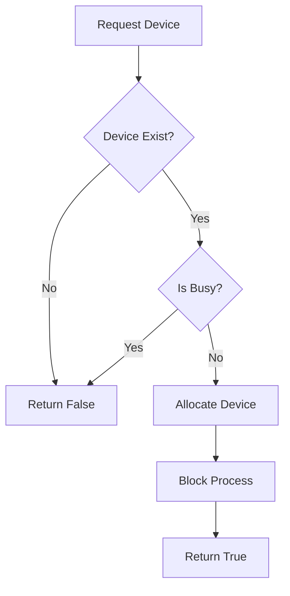

# IOManager.java Documentation

## Flowchart

## Line-by-Line Explanation

| Line | Code Snippet | Explanation |
| :--- | :--- | :--- |
| `9` | `public class IOManager` | Manages the collection of I/O devices in the system. |
| `13` | `private IOManager()` | Private constructor creating default devices (Keyboard, Mouse, etc.). |
| `34` | `public boolean requestDevice(int pid, String deviceName)` | Handles process requests for hardware access. |
| `38` | `dev.allocate(pid)` | Transitions the device status to busy. |
| `44` | `Kernel.getProcessManager().blockProcess(pid)` | Crucial OS step: the process must wait for the "slow" I/O to finish. |
| `53` | `public void releaseDevice(int pid, String deviceName)` | Handles the completion of an I/O task. |
| `62` | `Kernel.getProcessManager().wakeupProcess(pid)` | Transitions the process back to READY state now that I/O is done. |

## Code Flow & Dry Run Example

**Scenario**: PID 5 calls `requestDevice(5, "Keyboard")`.

1.  `IOManager` iterates through `devices`.
2.  Matches "Keyboard".
3.  Checks `isBusy()` -> `false`.
4.  Calls `keyboard.allocate(5)`.
5.  Calls `ProcessManager.blockProcess(5)`.
6.  The CPU is freed for other processes while PID 5 "waits" for input.
