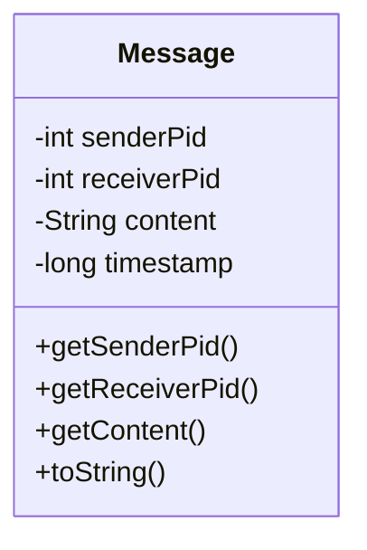

# Message.java Documentation

## Flowchart

## Line-by-Line Explanation

| Line | Code Snippet | Explanation |
| :--- | :--- | :--- |
| `3` | `public class Message` | Data object representing an IPC message. |
| `4-7` | `private final int senderPid; ... long timestamp;` | Immutable fields for message routing and content. |
| `9` | `public Message(int senderPid, ...)` | Constructor that also captures the system time of message creation. |
| `22` | `public String toString()` | Formats the message for display in logs: `[Sender -> Receiver]: Content`. |

## Code Flow & Dry Run Example

**Scenario**: A message is created.

1.  `new Message(1, 2, "Hello")` is executed.
2.  `senderPid` stores `1`.
3.  `receiverPid` stores `2`.
4.  `content` stores `"Hello"`.
5.  `timestamp` stores the current epoch time.
6.  `toString()` would return: `[1 -> 2]: Hello`.
