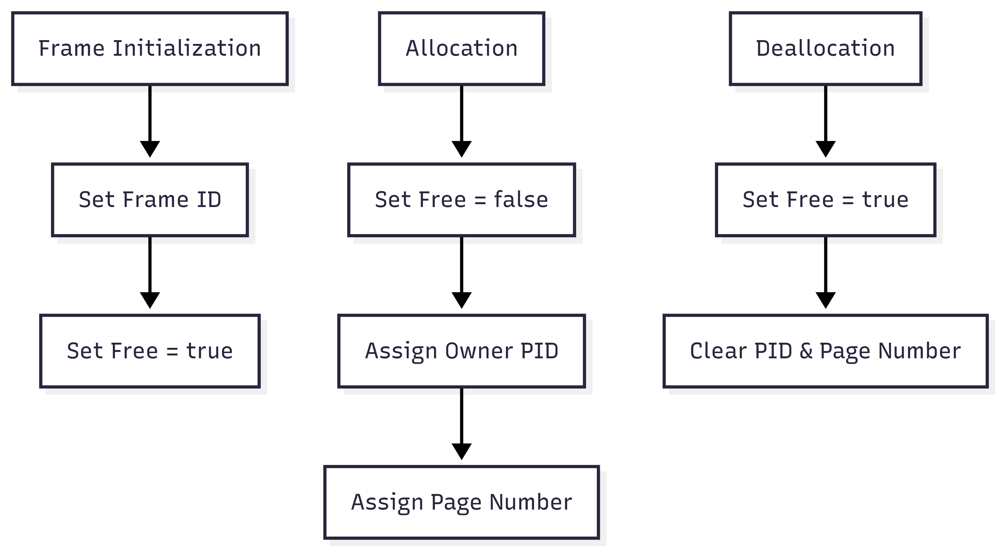

# MemoryFrame.java Documentation

## Flowchart

## Line-by-Line Explanation

| Line | Code Snippet | Explanation |
| :--- | :--- | :--- |
| `3` | `public class MemoryFrame` | Represents a single physical unit of memory (RAM). |
| `4` | `private final int frameNumber;` | Unique hardware address ID (0, 1, 2...). |
| `5` | `private boolean free = true;` | Status flag indicating if the frame is empty. |
| `6` | `private int owningPid = -1;` | Tracks which process currently owns this frame. |
| `21` | `public void setFree(boolean free)` | Updates status. If freeing, resets ownership details. |
| `33` | `public void setOwningPid(int owningPid)` | Assigns the frame to a process, automatically marking it as occupied. |

## Code Flow & Dry Run Example

**Scenario**: Frame 5 is allocated to Process 10, Page 2.

1.  **Start**: `frameNumber`=5, `free`=true, `owningPid`=-1.
2.  **Action**: `MemoryManager` calls `frame.setOwningPid(10)`.
    *   `owningPid` becomes 10.
    *   `free` becomes false.
3.  **Action**: `frame.setPageNumber(2)`.
    *   `pageNumber` becomes 2.
4.  **Result**: Frame 5 now "contains" Page 2 of Process 10.
