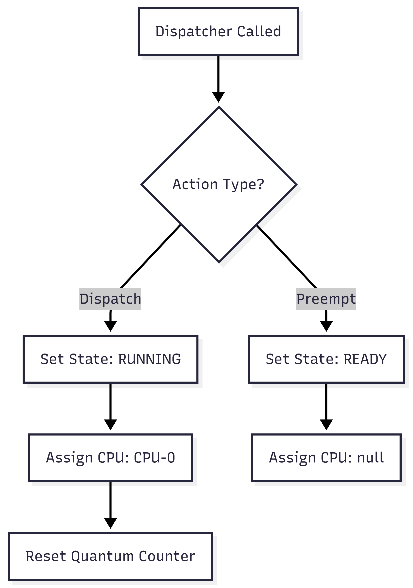

# Dispatcher.java Documentation

## Flowchart

## Line-by-Line Explanation

| Line | Code Snippet | Explanation |
| :--- | :--- | :--- |
| `6` | `public class Dispatcher` | Component responsible for performing the context switch. |
| `8` | `public void dispatch(PCB pcb)` | Loads a process onto the CPU. |
| `9` | `pcb.setState(ProcessState.RUNNING)` | Updates the process status so the world knows it's active. |
| `10` | `pcb.setAssignedProcessor("CPU-0")` | Simulates assigning a specific core (useful for multi-core expansion). |
| `11` | `pcb.resetQuantum()` | Resets the time slice counter for Round Robin scheduling. |
| `14` | `public void preempt(PCB pcb)` | Removes a process from the CPU (e.g., time expiry or higher priority arrival). |
| `15` | `pcb.setState(ProcessState.READY)` | Moves process back to the waiting state. |
| `16` | `pcb.setAssignedProcessor(null)` | Detaches the CPU from the process. |

## Code Flow & Dry Run Example

**Scenario**: Switching from Process A to Process B.

1.  **Preemption (Process A)**:
    *   `ProcessManager` calls `dispatcher.preempt(ProcessA)`.
    *   `ProcessA` state becomes `READY`.
    *   `ProcessA` processor becomes `null`.
2.  **Dispatch (Process B)**:
    *   `ProcessManager` calls `dispatcher.dispatch(ProcessB)`.
    *   `ProcessB` state becomes `RUNNING`.
    *   `ProcessB` processor becomes `CPU-0`.
    *   `ProcessB` quantum counter reset to 0.
