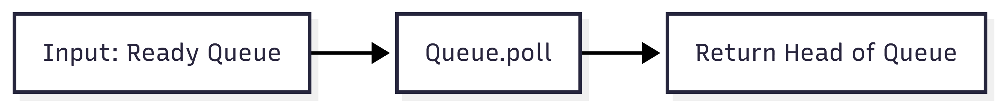

# FCFSScheduler.java Documentation

## Flowchart

## Line-by-Line Explanation

| Line | Code Snippet | Explanation |
| :--- | :--- | :--- |
| `6` | `public class FCFSScheduler implements Scheduler` | Implements the Scheduler interface using First-Come, First-Served logic. |
| `9` | `public PCB selectNextProcess(Queue<PCB> readyQueue)` | The decision method. |
| `10` | `return readyQueue.poll();` | Retrieves and removes the head of the queue (the process waiting longest). |
| `15` | `return "First Come First Serve (FCFS)";` | Returns the human-readable name for the UI. |

## Code Flow & Dry Run Example

**Scenario**: Ready Queue = [P1, P2, P3].

1.  `selectNextProcess(queue)` is called.
2.  `queue.poll()` is executed.
    *   Returns `P1`.
    *   Queue becomes [P2, P3].
3.  Simplicity itself: no complex logic, just FIFO (First In, First Out).
