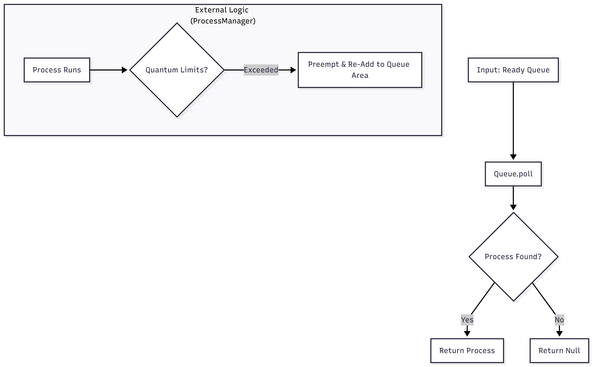

# RoundRobinScheduler.java Documentation

## Flowchart

*Note: The `RoundRobinScheduler` class itself primarily behaves like FIFO in `selectNextProcess`. The "Round Robin" logic (checking the quantum) is actually enforced by `ProcessManager.tick()` using `getTimeQuantum()` from this class.*

## Line-by-Line Explanation

| Line | Code Snippet | Explanation |
| :--- | :--- | :--- |
| `6` | `public class RoundRobinScheduler implements Scheduler` | Strategy for Round Robin scheduling. |
| `8` | `private final int timeQuantum;` | Stores the max time slice allowed per turn. |
| `10` | `public RoundRobinScheduler(int timeQuantum)` | Constructor setting the quantum. |
| `16` | `return readyQueue.poll();` | Picks the next available process. |
| `24` | `public int getTimeQuantum()` | Accessor used by `ProcessManager` to check if preemption is needed. |

## Code Flow & Dry Run Example

**Scenario**: Running Process P1 with Quantum = 2.

1.  **Selection**: `selectNextProcess` picks P1 from head of queue.
2.  **Execution (Tick)**: `ProcessManager` calls `tick()`.
    *   It checks `scheduler.getTimeQuantum()` (returns 2).
    *   It checks `P1.getQuantumCounter()`.
3.  **Expiry**: If P1 logic runs for > 2 ticks:
    *   `ProcessManager` detects `counter >= quantum`.
    *   P1 is preempted and added to the *back* of the queue.
    *   `selectNextProcess` will now pick P2 (the new head).
