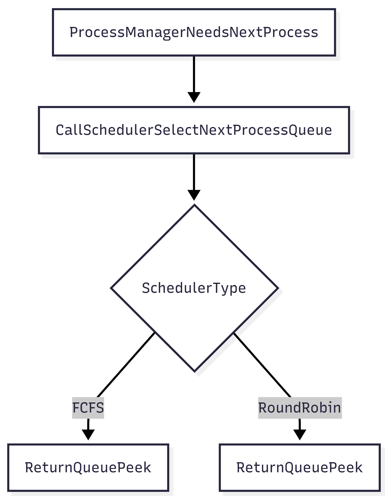

# Scheduler.java (Interface) Documentation

## Flowchart (Concept)

*Note: The interface itself has no logic, but implementations like `FCFSScheduler` and `RoundRobinScheduler` dictate the flow.*

## Line-by-Line Explanation

| Line | Code Snippet | Explanation |
| :--- | :--- | :--- |
| `1` | `package kernx.os.scheduler;` | Package declaration. |
| `6` | `public interface Scheduler` | Defines the contract for all scheduling algorithms. |
| `8` | `PCB selectNextProcess(Queue<PCB> readyQueue);` | The core method. Input: Ready Queue. Output: The next PCB to run. |
| `10` | `String getName();` | Returns the display name of the algorithm (e.g., "Round Robin"). |

## Code Flow & Dry Run Example

**Scenario**: Switching from FCFS to Round Robin.

1.  `ProcessManager` holds a `Scheduler` reference.
2.  User clicks "Use Round Robin" in UI.
3.  `ProcessManager.setScheduler(new RoundRobinScheduler(4))`.
4.  Next time `dispatchNextProcess()` is called:
    *   It invokes `scheduler.selectNextProcess()`.
    *   The `RoundRobinScheduler` implementation is executed.
