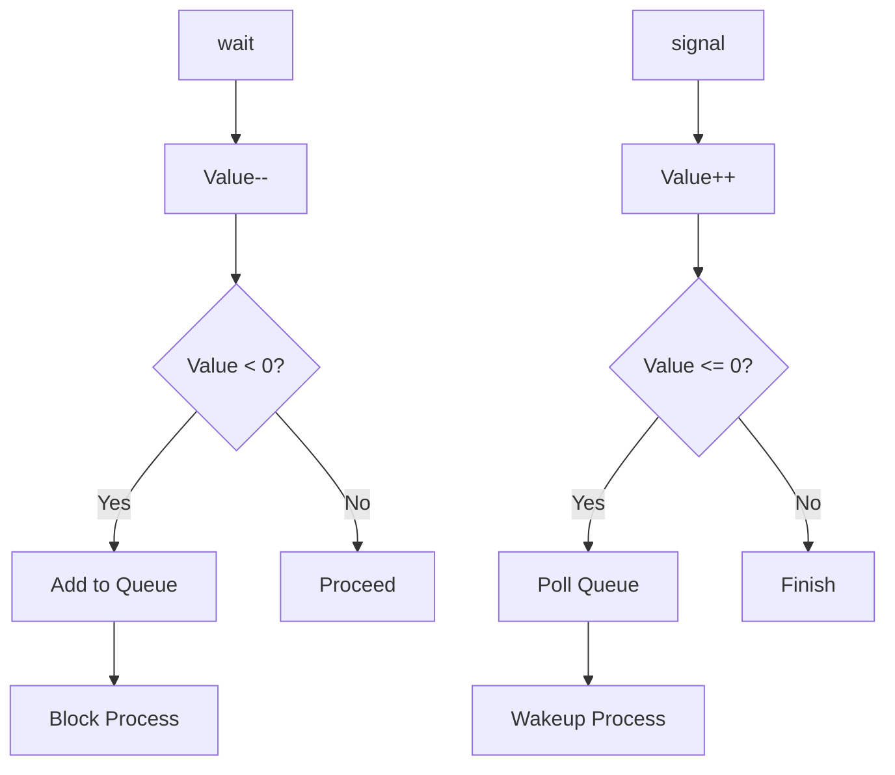

# Semaphore.java Documentation

## Flowchart

## Line-by-Line Explanation

| Line | Code Snippet | Explanation |
| :--- | :--- | :--- |
| `8` | `public class Semaphore` | Implementation of a counting semaphore for process synchronization. |
| `9` | `private int value` | The semaphore counter. Positive = resources available; Negative = processes waiting. |
| `12` | `private final Queue<PCB> waitingQueue` | List of processes blocked on this semaphore. |
| `21` | `public synchronized void wait(PCB pcb)` | The **P (Proberen)** operation. Decrements value and blocks if necessary. |
| `31` | `public synchronized PCB signal()` | The **V (Verhogen)** operation. Increments value and wakes up waiting processes. |

## Code Flow & Dry Run Example

**Scenario**: Semaphore "Mutex" with value 1. PID 1 calls `wait`.

1.  `value` becomes `0`.
2.  `0 < 0` is false. PID 1 proceeds (enters critical section).
3.  PID 2 calls `wait`.
4.  `value` becomes `-1`.
5.  `-1 < 0` is true.
6.  PID 2 is added to `waitingQueue` and its state is set to `BLOCKED`.
7.  PID 1 calls `signal`.
8.  `value` becomes `0`.
9.  `0 <= 0` is true. `waitingQueue` is not empty.
10. PID 2 is polled and set to `READY`.
11. `signal` returns PID 2 so the kernel can handle scheduling.
