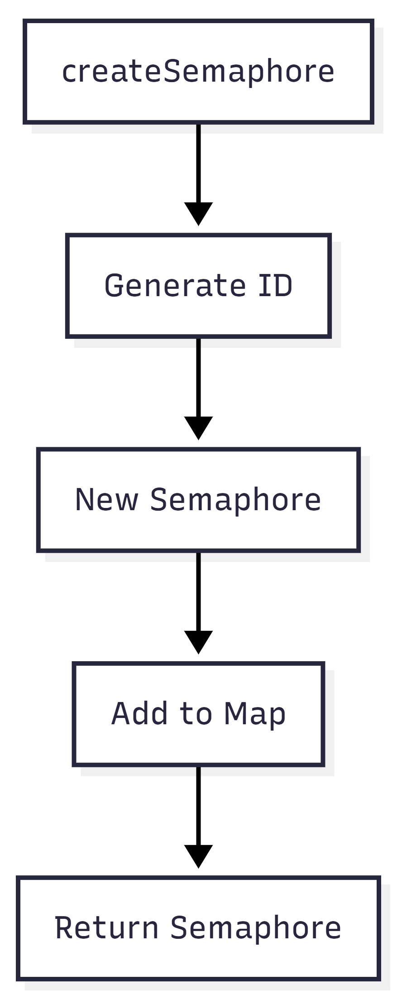

# SyncManager.java Documentation

## Flowchart

## Line-by-Line Explanation

| Line | Code Snippet | Explanation |
| :--- | :--- | :--- |
| `8` | `public class SyncManager` | Singleton manager for all semaphores in the system. |
| `10` | `Map<Integer, Semaphore> semaphores` | Registry of active semaphores. |
| `24` | `public Semaphore createSemaphore(...)` | Factory method to create and register semaphores. |
| `31` | `public Semaphore getSemaphore(int id)` | Retrieves a specific semaphore by its unique ID. |

## Code Flow & Dry Run Example

**Scenario**: User clicks "Create Semaphore" in UI.

1.  `createSemaphore("Printer", 1)` is called.
2.  `semaphoreCounter` (initially 0) is assigned to `id`.
3.  `semaphoreCounter` increments to 1.
4.  A new `Semaphore(0, "Printer", 1)` is created.
5.  It is put into the map with key `0`.
6.  The instance is returned to the UI for display.
