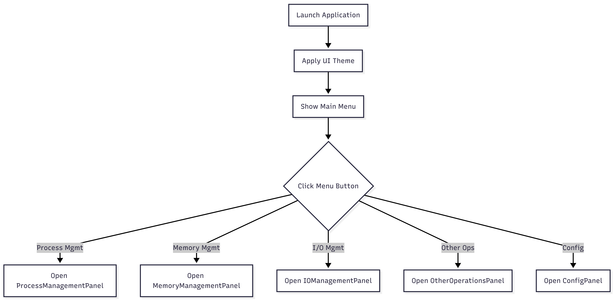

# MainFrame.java Documentation

## Flowchart

## Line-by-Line Explanation

| Line | Code Snippet | Explanation |
| :--- | :--- | :--- |
| `10` | `public class MainFrame` | The main window frame and entry point for users. |
| `15` | `UITheme.applyGlobalTheme();` | Initializes the dark mode and component styling. |
| `34-38` | `JButton processBtn; ... configBtn;` | Navigation buttons for the different OS subsystems. |
| `40-44` | `openPanel(...)` | Action listeners that launch specific sub-windows. |
| `62` | `private void openPanel(JPanel panel)` | Generic helper to wrap a panel into a new `JFrame` and display it. |
| `70` | `public static void main(...)` | The standard Java entry point. Starts the Swing application. |

## Code Flow & Dry Run Example

**Scenario**: User starts the application and wants to check memory.

1.  `MainFrame.main` is called.
2.  `UITheme` sets the look and feel.
3.  The menu window appears in the center of the screen.
4.  User clicks "Memory Management".
5.  `openPanel(new MemoryManagementPanel())` is called.
6.  A new maximized window opens showing the memory grid.
7.  The main menu stays accessible in the background.
