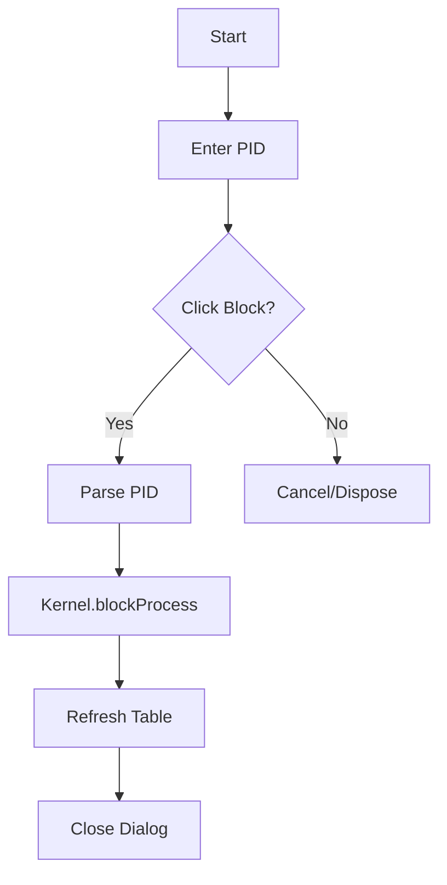

# BlockProcessDialog.java Documentation

## Flowchart

## Line-by-Line Explanation

| Line | Code Snippet | Explanation |
| :--- | :--- | :--- |
| `12` | `public class BlockProcessDialog` | Dialog for manual process blocking. |
| `43` | `actionBtn.addActionListener(...)` | Triggered when the user confirms the PID. |
| `45` | `int pid = Integer.parseInt(...)` | Converts user text to a numeric ID. |
| `46` | `Kernel.getProcessManager().blockProcess(pid)` | Backend command to move process to BLOCKED state. |
| `47` | `tablePanel.refresh()` | Updates the main UI to reflect the change. |

## Code Flow & Dry Run Example

**Scenario**: User blocks PID 101.
1. User types "101" into the text field.
2. User clicks "Block".
3. `Integer.parseInt("101")` returns 101.
4. `ProcessManager` finds PCB 101 and moves it to the blocked queue.
5. The dialogue closes and the main table now shows PID 101 as `BLOCKED`.
