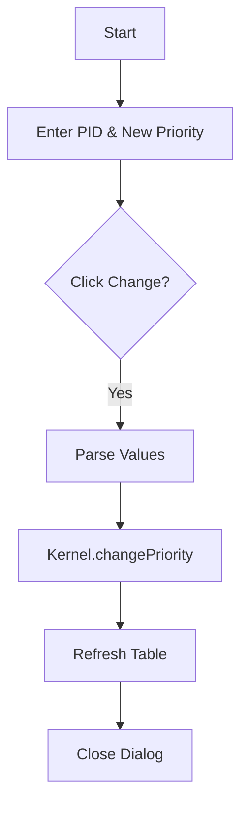

# ChangePriorityDialog.java Documentation

## Flowchart

## Line-by-Line Explanation

| Line | Code Snippet | Explanation |
| :--- | :--- | :--- |
| `10` | `public class ChangePriorityDialog` | Dialog for updating process priority. |
| `52` | `Kernel.getProcessManager().changePriority(...)` | Backend call using PID and New Priority. |
| `53-54` | `Integer.parseInt(pidField.getText()), Integer.parseInt(priorityField.getText())` | Gathers and parses both required inputs. |

## Code Flow & Dry Run Example

**Scenario**: Change PID 101 priority to 5.
1. Enter PID: 101, Priority: 5.
2. Click Change.
3. Logical core updates PCB 101 `priority` field to 5.
4. Table refreshes, showing the new priority.
