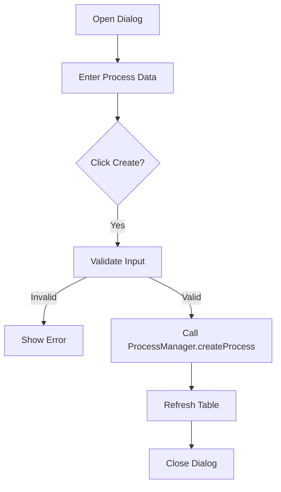

# CreateProcessDialog.java Documentation

## Flowchart

## Line-by-Line Explanation

| Line | Code Snippet | Explanation |
| :--- | :--- | :--- |
| `10` | `public class CreateProcessDialog` | Modal dialog for defining and creating a new process. |
| `24-28` | `JTextField ownerField; ... arrivalField;` | Input fields for process attributes. |
| `47` | `JButton addBtn = UITheme.createStyledButton("Create");` | The primary action button. |
| `52` | `if (createProcess(...))` | Internal helper that validates and executes creation. |
| `106` | `Kernel.getProcessManager().createProcess(...)` | The actual kernel call to instantiate the process. |

## Code Flow & Dry Run Example

**Scenario**: User wants to add a process with 200KB memory and Priority 2.

1.  User enters "Admin" in Owner, "200" in Memory, "2" in Priority.
2.  User clicks "Create".
3.  `createProcess()` is triggered.
4.  `Integer.parseInt("200")` and `Integer.parseInt("2")` are called successfully.
5.  `ProcessManager.createProcess("Admin", 200, 2, ...)` is invoked.
6.  The dialog closes, and the main process table now shows the new process.
