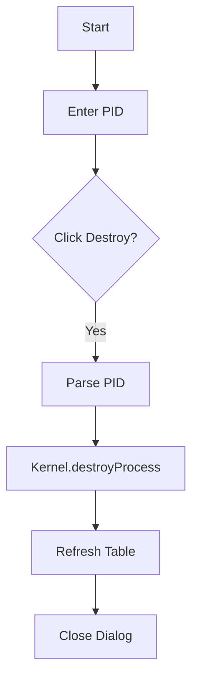

# DestroyProcessDialog.java Documentation

## Flowchart

## Line-by-Line Explanation

| Line | Code Snippet | Explanation |
| :--- | :--- | :--- |
| `10` | `public class DestroyProcessDialog` | Dialog for terminating a process. |
| `51` | `Kernel.getProcessManager().destroyProcess(pid)` | Backend command to kill the process and free its resources. |
| `53` | `dispose()` | Closes the UI window. |

## Code Flow & Dry Run Example

**Scenario**: Kill PID 105.
1. User enters 105.
2. Kernel removes PCB 105 from all queues.
3. Memory allocated to 105 is marked as free.
4. UI table clears the row for 105.
