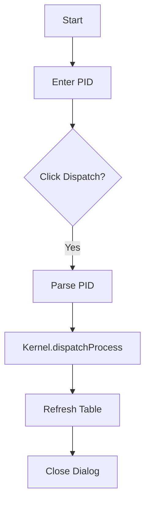

# DispatchProcessDialog.java Documentation

## Flowchart

## Line-by-Line Explanation

| Line | Code Snippet | Explanation |
| :--- | :--- | :--- |
| `45` | `int pid = Integer.parseInt(...)` | Input capture. |
| `46` | `Kernel.getProcessManager().dispatchProcess(pid)` | Forces a context switch to the selected PID. |

## Code Flow & Dry Run Example

**Scenario**: Manually run PID 110.
1. Enter 110. Click Dispatch.
2. Scheduler pulls 110 from READY/BLOCKED and sets its state to RUNNING.
3. Previous running process is moved to READY.
