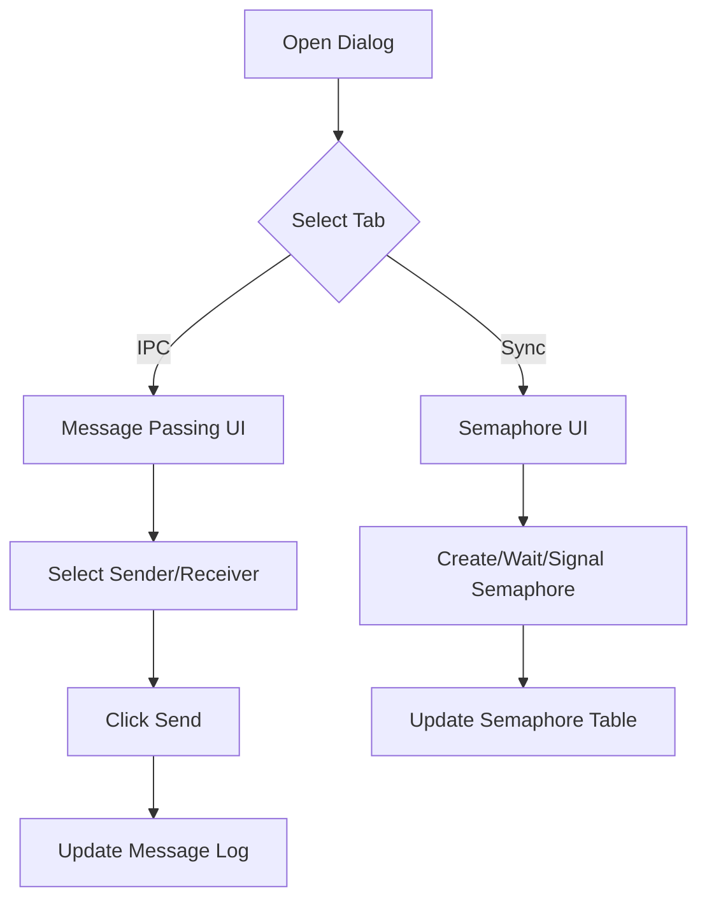

# ProcessCommunicationDialog.java Documentation

## Flowchart

## Line-by-Line Explanation

| Line | Code Snippet | Explanation |
| :--- | :--- | :--- |
| `14` | `public class ProcessCommunicationDialog` | Complex dialog handling Phase 4 features: IPC and Synchronization. |
| `30` | `JTabbedPane tabbedPane = new JTabbedPane();` | Organizes features into two distinct tabs. |
| `49` | `private JPanel createIPCPanel()` | Builds the interface for message passing. |
| `99` | `private JPanel createSyncPanel()` | Builds the interface for semaphore management. |
| `141` | `waitBtn.addActionListener(...)` | Triggers the **wait(P)** operation on a selected semaphore. |
| `169` | `signalBtn.addActionListener(...)` | Triggers the **signal(V)** operation to resume a waiting process. |
| `210` | `private void sendMessage()` | Gathers UI data and calls the `IPCManager` to route a message. |

## Code Flow & Dry Run Example

**Scenario**: User sends a message via IPC tab.

1.  User selects "PID 0" as sender and "PID 1" as receiver.
2.  User types "Hello" and clicks "Send".
3.  `sendMessage()` creates a `Message` object.
4.  `Kernel.getIPCManager().sendMessage(msg)` is called.
5.  `refreshChatLog()` is called to update the visual log on the screen.
