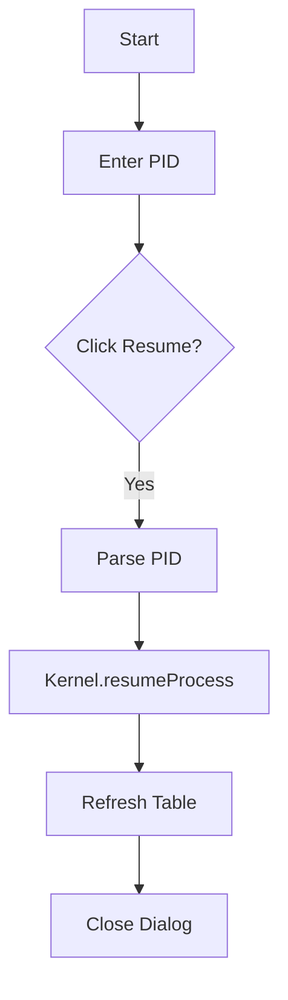

# ResumeProcessDialog.java Documentation

## Flowchart

## Line-by-Line Explanation

| Line | Code Snippet | Explanation |
| :--- | :--- | :--- |
| `46` | `Kernel.getProcessManager().resumeProcess(pid)` | Wakes a process from SUSPENDED state. |

## Code Flow & Dry Run Example

**Scenario**: Resume PID 102.
1. Enter 102.
2. Kernel moves 102 from `suspendedQueue` to `readyQueue`.
3. State changes from `SUSPENDED` to `READY`.
