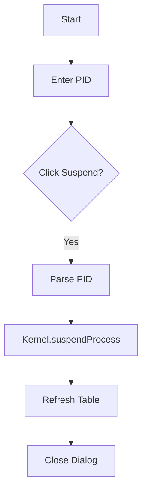

# SuspendProcessDialog.java Documentation

## Flowchart

## Line-by-Line Explanation

| Line | Code Snippet | Explanation |
| :--- | :--- | :--- |
| `46` | `Kernel.getProcessManager().suspendProcess(pid)` | Places process in swapped-out/suspended state. |

## Code Flow & Dry Run Example

**Scenario**: Suspend PID 101.
1. Enter 101.
2. Kernel moves 101 to `suspendedQueue`.
3. Process stops competing for CPU but stays in system memory/registry.
