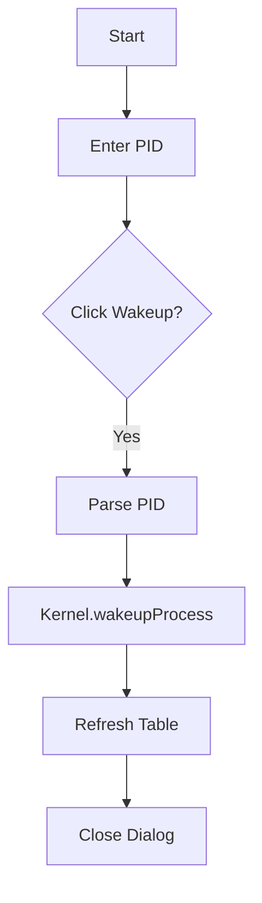

# WakeupProcessDialog.java Documentation

## Flowchart

## Line-by-Line Explanation

| Line | Code Snippet | Explanation |
| :--- | :--- | :--- |
| `46` | `Kernel.getProcessManager().wakeupProcess(pid)` | Moves process from BLOCKED to READY. |

## Code Flow & Dry Run Example

**Scenario**: PID 105 finishes I/O.
1. User enters 105.
2. Kernel moves 105 from `blockedQueue` to `readyQueue`.
3. Process becomes eligible for execution again.
