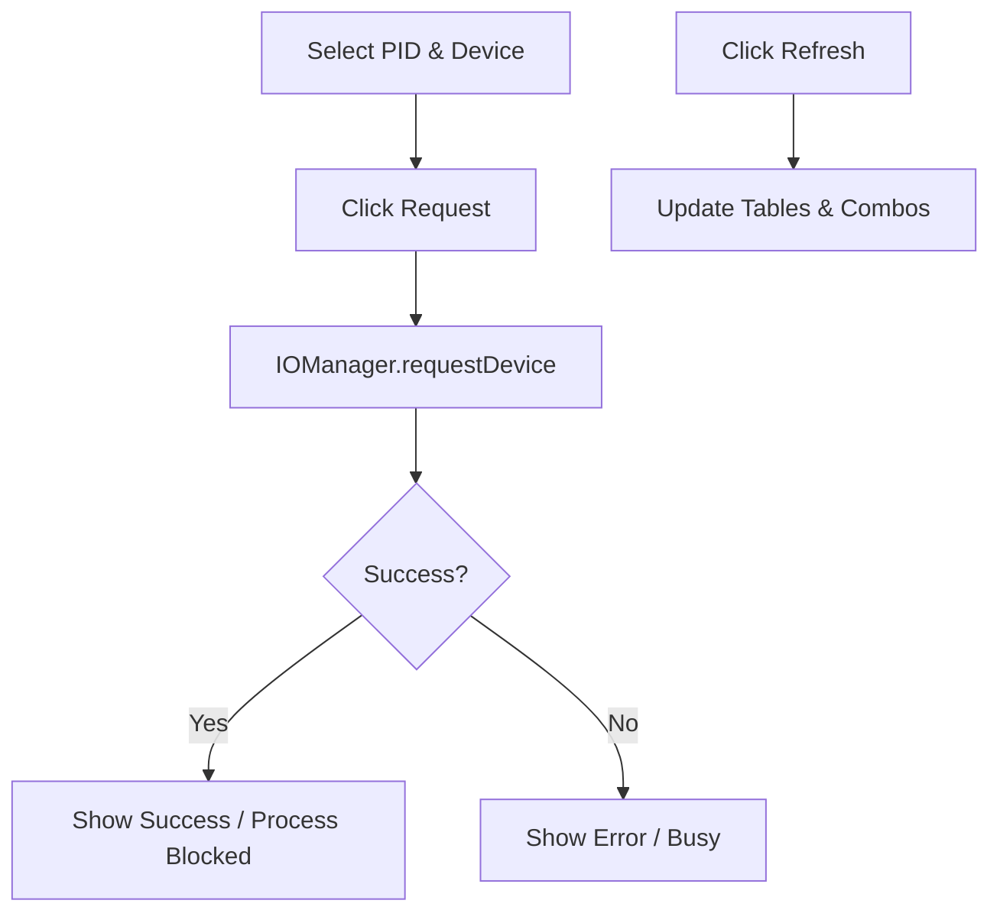

# IOManagementPanel.java Documentation

## Flowchart

## Line-by-Line Explanation

| Line | Code Snippet | Explanation |
| :--- | :--- | :--- |
| `13` | `public class IOManagementPanel` | View for managing hardware devices and process I/O requests. |
| `34` | `deviceTableModel = new DefaultTableModel(...)` | Data model for the hardware device status table. |
| `46-47` | `processCombo; deviceCombo;` | Selection components for targeting requests. |
| `80` | `private void refreshData()` | Pulls latest device and process states from the kernel. |
| `110` | `Kernel.getIOManager().requestDevice(pid, devName)` | Invokes the logic to allocate a device and block the process. |
| `127` | `Kernel.getIOManager().releaseDevice(pid, devName)` | Invokes logic to free a device and wake up the owner. |

## Code Flow & Dry Run Example

**Scenario**: Allocate "HDD" to PID 1.

1.  User selects "1" from `processCombo` and "HDD" from `deviceCombo`.
2.  User clicks "Request Device".
3.  `handleRequest()` calls `IOManager.requestDevice(1, "HDD")`.
4.  The HDD becomes BUSY in the table.
5.  A dialog confirms the process is now blocked in the backend.
6.  `refreshData()` updates the UI table.
