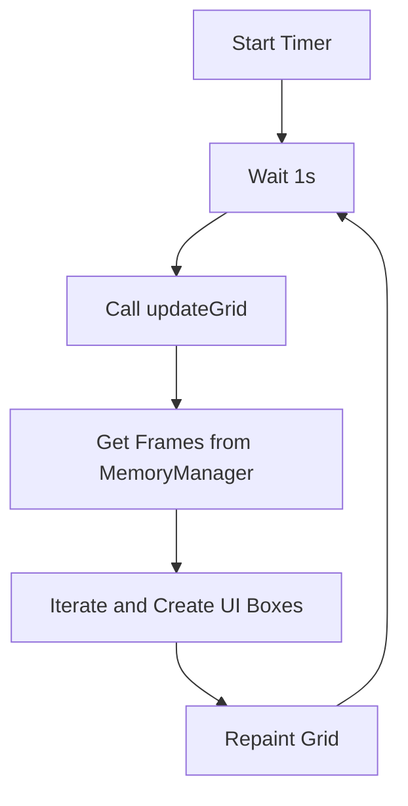

# MemoryManagementPanel.java Documentation

## Flowchart

## Line-by-Line Explanation

| Line | Code Snippet | Explanation |
| :--- | :--- | :--- |
| `12` | `public class MemoryManagementPanel` | Visual representation of the physical memory frames. |
| `28` | `updateGrid();` | The core rendering method. |
| `48` | `Timer timer = new Timer(1000, ...)` | Polling timer to keep the memory view in sync with allocations. |
| `54` | `MemoryManager.getInstance().getFrames();` | Accesses the actual backend memory state. |
| `64` | `frame.isFree() ? UITheme.SUCCESS : UITheme.DANGER` | Uses Color (Green/Red) to indicate frame allocation status. |
| `74` | `frame.getOwningPid()` | Displays which process is currently occupying the frame. |

## Code Flow & Dry Run Example

**Scenario**: A process is created and allocated 8KB (2 frames).

1.  The `updateGrid()` method is triggered by the timer.
2.  It finds that Frames #0 and #1 now have `isFree() == false`.
3.  For these two frames:
    - Background is set to `UITheme.DANGER` (Red).
    - PID label is added (e.g., "PID: 1").
    - Page label is added (e.g., "P: 0").
4.  The grid is repainted, showing the visual "fill" of memory.
