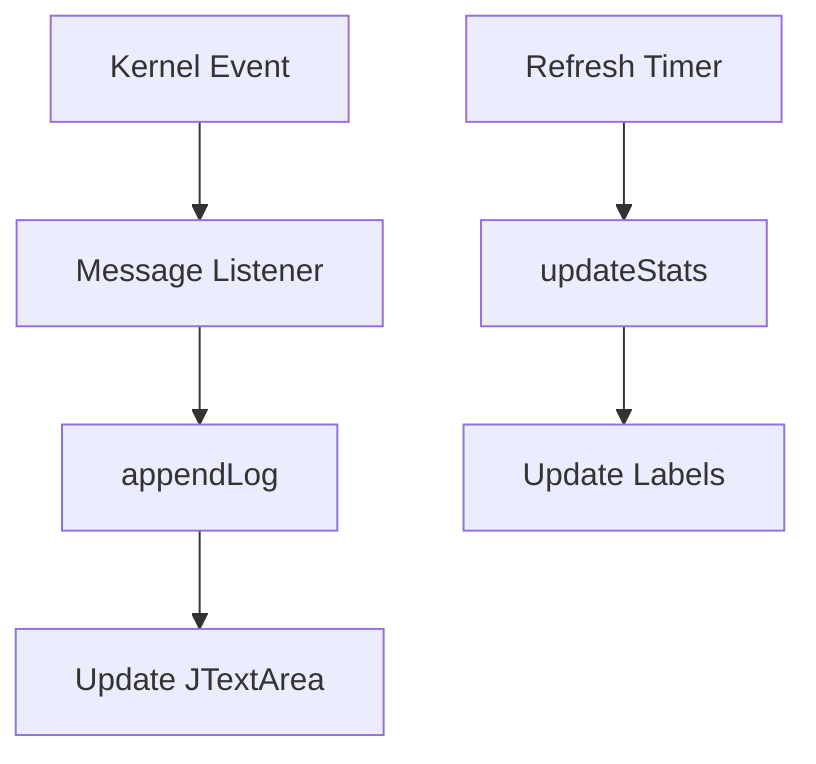

# OtherOperationsPanel.java Documentation

## Flowchart

## Line-by-Line Explanation

| Line | Code Snippet | Explanation |
| :--- | :--- | :--- |
| `9` | `public class OtherOperationsPanel` | Miscellaneous operations: System stats, Logs, and "About" info. |
| `22-34` | `statsPanel` | Displays Uptime and the count of managed processes. |
| `41` | `logArea = new JTextArea();` | The central system console showing historical kernel actions. |
| `65` | `Kernel.getProcessManager().setMessageListener(...)` | Registers the panel to receive real-time notifications from the OS. |
| `72` | `private void appendLog(String msg)` | Thread-safe method to push text to the log area. |
| `79` | `private void updateStats()` | Polling method to sync uptime/process count labels. |

## Code Flow & Dry Run Example

**Scenario**: A process is killed via the UI.

1.  `ProcessManager` removes the PID and calls `notifyListeners("Process [5] Destroyed")`.
2.  `OtherOperationsPanel` receives this string via the registered listener.
3.  `appendLog()` is called.
4.  `SwingUtilities.invokeLater()` ensures the UI update is done on the Event Dispatch Thread.
5.  "Process [5] Destroyed" appears at the bottom of the log area.
