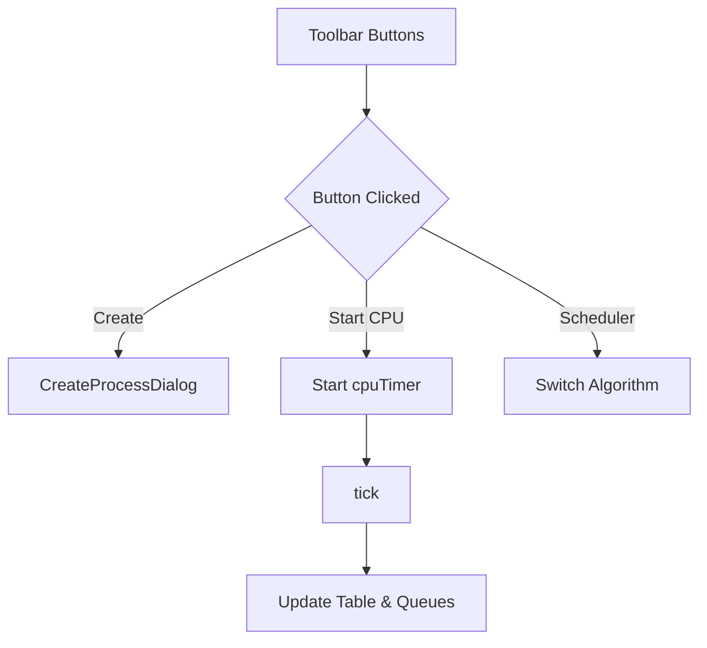

# ProcessManagementPanel.java Documentation

## Flowchart

## Line-by-Line Explanation

| Line | Code Snippet | Explanation |
| :--- | :--- | :--- |
| `12` | `public class ProcessManagementPanel` | The main dashboard for process control and CPU simulation. |
| `33-41` | `JButton createBtn; ... communicationBtn;` | Toolbar buttons connecting to various OS operations via dialogs. |
| `45` | `JComboBox<String> schedulerCombo` | Dropdown to switch between FCFS and Round Robin algorithms. |
| `85` | `snackbar = new Snackbar();` | A custom notification component for kernel events. |
| `148` | `schedulerCombo.addActionListener(...)` | Logic to swap the scheduler instance in the `ProcessManager`. |
| `170` | `cpuTimer = new Timer(1000, ...)` | The heartbeat of the simulation: calls `tick()` every second. |
| `171` | `Kernel.getProcessManager().tick();` | Moves the simulation forward by one time unit. |

## Code Flow & Dry Run Example

**Scenario**: User starts the CPU.

1.  User clicks "Start CPU".
2.  `cpuTimer.start()` is called.
3.  Every 1000ms, the timer event fires.
4.  `ProcessManager.tick()` is executed (handles scheduling, burst reduction).
5.  `processTablePanel.refresh()` is called.
6.  The UI updates to reflect decreased remaining burst times and state changes.
