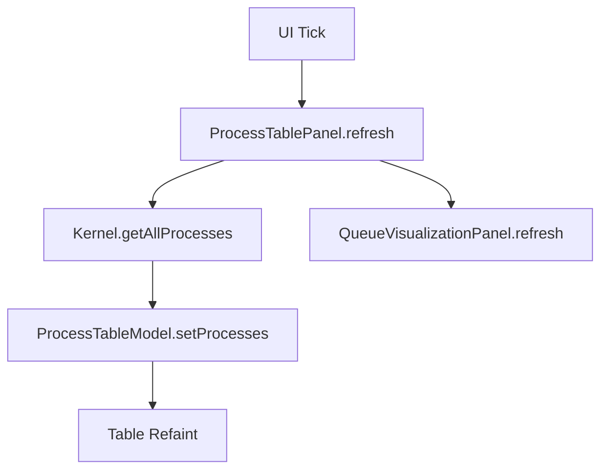

# ProcessTablePanel.java Documentation

## Flowchart

## Line-by-Line Explanation

| Line | Code Snippet | Explanation |
| :--- | :--- | :--- |
| `14` | `public class ProcessTablePanel` | Container for the main process table. |
| `26` | `model = new ProcessTableModel();` | Connects the data source to the visual table. |
| `62` | `setQueueVisualizationPanel(...)` | Linkage for synchronized updates. |
| `70` | `public void refresh()` | Core method called to pull latest process data. |

## Code Flow & Dry Run Example

**Scenario**: A process is created.
1. `ProcessManagementPanel` calls `tablePanel.refresh()`.
2. `Kernel.getProcessManager().getAllProcesses()` returns the list with the new PID.
3. `tableModel.setProcesses(list)` is called.
4. The `JTable` triggers a repaint showing the new row.
