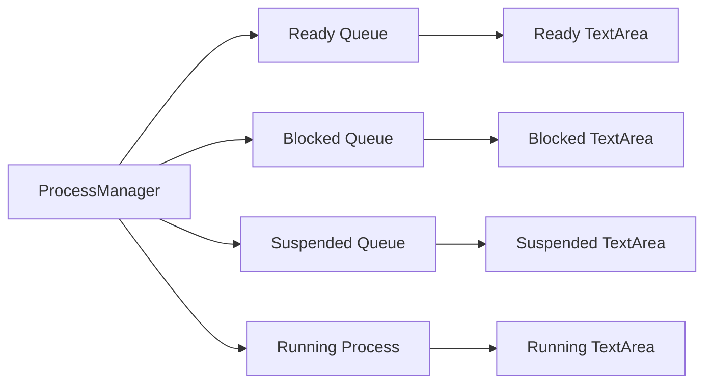

# Process Table & Queue Listing Documentation

## 1. ProcessTablePanel.java
This panel hosts the `JTable` that displays the primary process list (PCB data).

| Key Method | Explanation |
| :--- | :--- |
| `refresh()` | Fetches all processes from `Kernel` and updates the `ProcessTableModel`. It also triggers a refresh of the `queuePanel`. |
| `setQueueVisualizationPanel(...)` | Links the table to the queue areas at the bottom of the screen. |

---

## 2. QueueVisualizationPanel.java
A visual representation of the four major scheduling states: Ready, Blocked, Suspended, and Running.

### Flowchart

### Line-by-Line Explanation

| Line | Code Snippet | Explanation |
| :--- | :--- | :--- |
| `13-16` | `JTextArea readyArea; ... runningArea;` | Text boxes representing each queue. |
| `60` | `public void refresh()` | The main update method called after every CPU tick. |
| `61-63` | `queueToString(...)` | Helper that converts a collection of PCBs into a readable vertical list. |
| `66` | `runningArea.setText(...)` | Specifically handles the single process (or IDLE state) on the CPU. |

## Code Flow Example
Every time the CPU ticks:
1.  `ProcessManager` updates its internal queues.
2.  `ProcessManagementPanel` calls `processTablePanel.refresh()`.
3.  `processTablePanel` calls `queuePanel.refresh()`.
4.  Each `JTextArea` is cleared and repopulated with current PID and Burst info.
