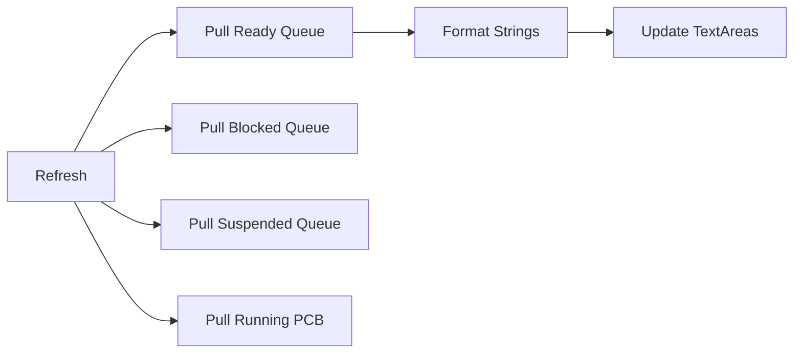

# QueueVisualizationPanel.java Documentation

## Flowchart

## Line-by-Line Explanation

| Line | Code Snippet | Explanation |
| :--- | :--- | :--- |
| `11` | `public class QueueVisualizationPanel` | Bottom panel showing process movement between queues. |
| `13-16` | `readyArea, blockedArea...` | Four distinct text areas for each scheduling state. |
| `60` | `public void refresh()` | Fetches live queues from `ProcessManager`. |
| `69` | `queueToString(Queue<PCB>)` | Formats a list of processes into vertical list: `PID: X | Owner | Burst`. |

## Code Flow & Dry Run Example

**Scenario**: Process moves from READY to RUNNING.
1. `refresh()` is called.
2. `getReadyQueue()` returns empty. `readyArea` shows "(empty)".
3. `getRunningProcess()` returns PID 101.
4. `runningArea` shows "PID: 101 | Admin | B:10".
