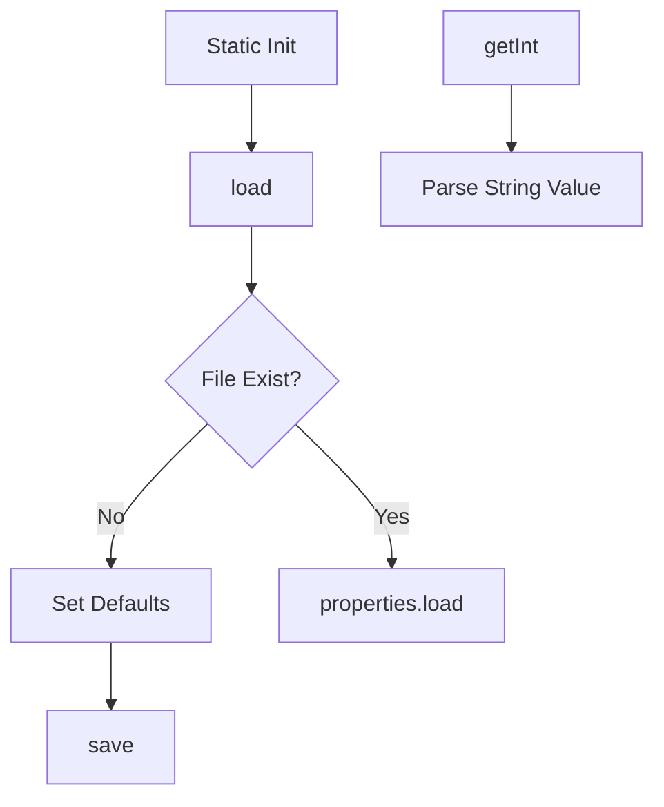

# ConfigManager.java Documentation

## Flowchart

## Line-by-Line Explanation

| Line | Code Snippet | Explanation |
| :--- | :--- | :--- |
| `6` | `public class ConfigManager` | Persistence manager for simulation settings. |
| `15` | `new FileInputStream(CONFIG_FILE)` | Reads `config.properties` from the local disk. |
| `19-20` | `setProperty("pageSize", "4")` | Default fallback values if disk file is missing. |
| `25` | `save()` | Flushes current Properties object back to the `.properties` file. |

## Code Flow & Dry Run Example

**Scenario**: First run of application.
1. `load()` fails (no file).
2. Properties `pageSize`=4, `totalMemory`=64 set in memory.
3. `save()` creates the `config.properties` file on disk.
4. `getPageSize()` returns 4.
